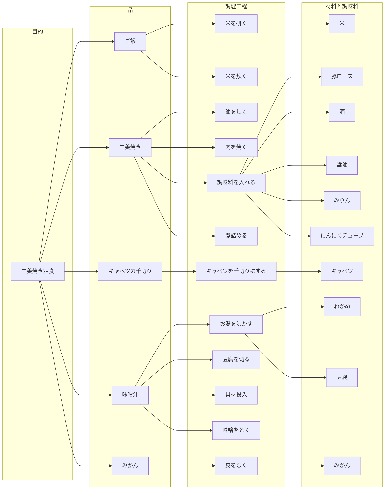

```mermaid  
flowchart LR
    subgraph "目的"
        plate[生姜焼き定食]  
    end
    subgraph "品"
        rice[ご飯]  
        meat[生姜焼き]  
        sarada[キャベツの千切り]  
        soup[味噌汁]  
        desert[みかん]  
    end
    subgraph "調理工程"
        process_rice[米を研ぐ]  
        process_rice1[米を炊く]  
        process_meat[油をしく]  
        process_meat1[肉を焼く]  
        process_meat2[調味料を入れる]  
        process_meat3[煮詰める]  
        process_sarada[キャベツを千切りにする]  
        process_soup[お湯を沸かす]
        process_soup2[豆腐を切る]
        process_soup3[具材投入]  
        process_soup4[味噌をとく]  
        process_desert[皮をむく]  
    end
    subgraph "材料と調味料"
        rice1[米]
        meat4[豚ロース]
        meat5[酒]
        meat6[醤油]
        meat7[みりん]
        meat8[にんにくチューブ]
        sarada1[キャベツ]
        soup5[わかめ]
        soup6[豆腐]
        desert1[みかん]
    end

    plate --> rice  
    plate --> meat  
    plate --> sarada 
    plate --> soup 
    plate --> desert 
    rice--> process_rice 
    rice--> process_rice1
    meat--> process_meat  
    meat--> process_meat1  
    meat--> process_meat2 
    meat--> process_meat3  
    sarada--> process_sarada
    soup-->process_soup
    soup-->process_soup2
    soup-->process_soup3  
    soup-->process_soup4  
    desert-->process_desert  
    process_rice-->rice1
    process_meat2-->meat4
    process_meat2-->meat5
    process_meat2-->meat6
    process_meat2-->meat7
    process_meat2-->meat8
    process_sarada-->sarada1
    process_soup-->soup5
    process_soup-->soup6
    process_desert-->desert1
```