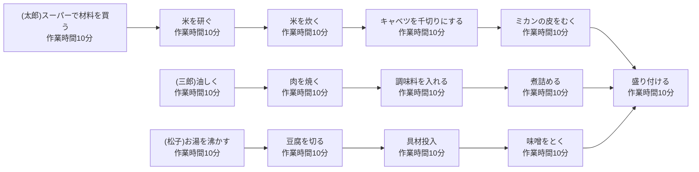

```mermaid
flowchart LR

t1["(太郎)スーパーで材料を買う"
    作業時間10分]
t2["米を研ぐ
    作業時間10分"]
t3["米を炊く
    作業時間10分"]
s1["(三郎)油しく
    作業時間10分"]
s2["肉を焼く
    作業時間10分"]
s3["調味料を入れる
    作業時間10分"]
s4["煮詰める
    作業時間10分"]
t4["キャベツを千切りにする
    作業時間10分"]
m1["(松子)お湯を沸かす
    作業時間10分"]
m2["豆腐を切る
    作業時間10分"]
m3["具材投入
    作業時間10分"]
m4["味噌をとく
    作業時間10分"]
t5["ミカンの皮をむく
    作業時間10分"]
t6["盛り付ける
    作業時間10分"]

    t1 --> t2
    t2 --> t3
    t3 --> t4
    t4 --> t5
    t5 --> t6

    s1 --> s2
    s2 --> s3
    s3 --> s4

    m1 --> m2
    m2 --> m3
    m3 --> m4

    s4 --> t6
    m4 --> t6
```